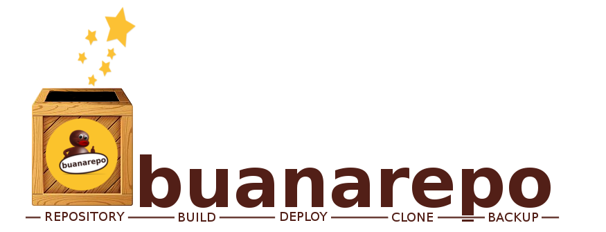

Buanaclient
############

Buanaclient is a buanarepo-server's agent. With buanarepo-client we can to create backups, git-clone, git-pull or deploy IT backends. Also, it builds a debian package from source code and add it into debian repository.

Install Buanaclient
*******************

Install
=======

1. Clone this repository
   
.. code:: console

  $ git clone https://github.com/nebul4ck/buanaclient.git
..

2. Build a debian package

.. code:: console

  $ cd buanaclient
  $ dpkg -b buanaclient/ buanaclient-1.6.0.deb
..

3. Install buanaclient debian package

.. code:: console

  $ sudo apt install ./buanaclient-1.6.0.deb
..

Configure
=========

* Set ip:port remote buanarepo server and API Authentication

.. code:: console

  # vi /etc/buanaclient/buanaconfig.conf

  # Buanaclient template configuration file #

  [connection]
  host = 'buanaserver-ip'
  port = 8081

  [auth]
  buanaServerCAcert = '/opt/buanaclient/certs/CA.crt'
  user = 'user'
  passwd = 'password'
..

* Get buanarepo server certificate:

will be neccessary create a CA and certs. You shoudl make it into buanaserver host.

Use
===

.. code:: console

  $ buanaclient --help

  ## Description
    BUANACLIENT (client)
    usage: buanaclient <COMMAND> <CONFILE>|<APPLICATION> (develop|master) (--local|--remote>) (none|python|node)
    
    NAME
      buanaclient - BUilds ANd Adds to REPO.
    
    SYNOPSIS
      buanaclient <COMMAND> <CONFILE>|<APPLICATION> (develop|master) (--local|--remote>) (none|python|node)
    
    DESCRIPTION
      Buanaclient is the simple way to create backups (remote dirs and Github),
      builds .deb packages, adds .deb to a central repository (continuous delivery) 
      and servers provisioning.
    
    COMMANDS
      backup  - Synchronizes directories.
      git   - Get a copy of an existing Git repository and builds the .deb package.
      mpkg  - Build package from Jenkins sources.
      deploy  - Servers provisioning.
      list  - Show available packages in BuanaServer.
    
    KNOWN LANGUAGES
      If use either git or mpkg commands, they will build debian package in BuanaServer. Automatically
      BuanaServer upload two packages to repository (a plain code program and another program with
      encrypted code). To encrypt the code will be necessary known the development language, ie:
      
        # buanaclient git|mpkg <repo_name> python|node
    
    DEPLOY MODES
      --local    - Buanaclient is installed in localbox. Install commands will be launch
             in localhost. In this case, buanaclient will be install into each server
             where you want install services.
      --remote   - Buanaclient is installed in orchestrator's server (agent). Install 
             commands will be launch from agent.
    
    CONFILE
      The name of the configuration file for provisioning. Is necessary create a
      configuration file into /etc/buanarepo/client or modify the template
      (deploy-server.conf.template)
    
      To run backups will be necessary edit /etc/buanarepo/client/buanaconfig.conf
    
    APPLICATION
      The name of application to sync and builds the package.
    
    EXAMPLES
    
      foobar = appname
    
      $ buanaclient list
      $ buanaclient backup foobar
      $ buanaclient git foobar develop|master python|node|none
      $ buanaclient mpkg foobar develop|master python|node|none
      $ buanaclient deploy deploy.conf --local|--remote
